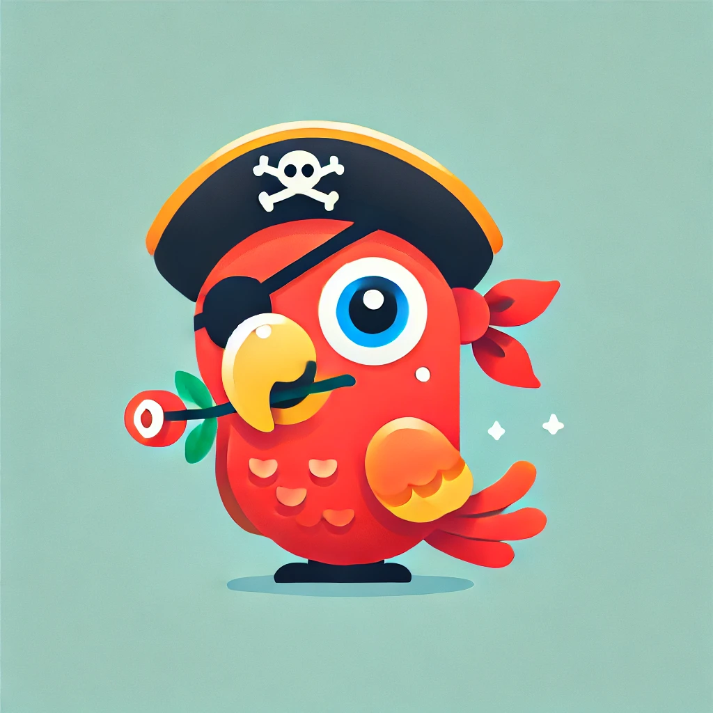

Colloquy
===

*Figure 1: Rossi, our mascot.*

---

This repo has all code to run the MAIC (MOSE AI Club) foreign language learning project.

See [this page](https://www.notion.so/Colloquy-Language-Learning-Setup-1d3b3d1ec5a08024bbb6fa3cecea29e3?pvs=4) for instructions on use. Start with the **Getting Started** section.

Go to Lucas Gral or Preston Whitcomb on MS Teams for questions.

Happy learning!
